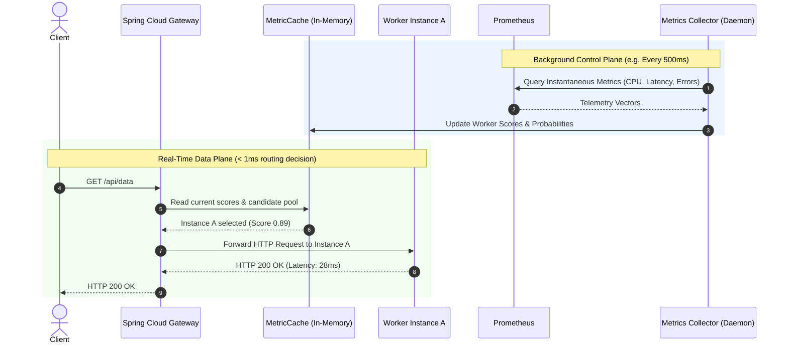

# System Architecture & Design Specification

## 1. Overview

The **Adaptive Load Balancer for Microservices (ALB-M)** is an intelligent reverse-proxy and routing fabric designed to replace static traffic balancing (Round Robin, Random, Least Connections) with an empirical, multi-metric closed-loop feedback controller.

The system decouples the **data path** (high-speed request routing) from the **control/monitoring path** (periodic telemetry ingestion and score calculation) to ensure sub-millisecond dispatch overhead while maintaining near real-time adaptation to microservice degradation.

---

## 2. High-Level Architectural Topology

```
                               ┌───────────────────────────┐
                               │   Clients / k6 Testbed    │
                               └─────────────┬─────────────┘
                                             │ HTTP/1.1 & HTTP/2
                                             ▼
┌────────────────────────────────────────────────────────────────────────────────────────┐
│                        ADAPTIVE GATEWAY (Spring Cloud Gateway)                         │
│                                                                                        │
│  ┌───────────────────────┐   ┌────────────────────────┐   ┌─────────────────────────┐  │
│  │ Reactive Route Filter │──▶│ Algorithm Selector     │──▶│ Routing Strategy Engine │  │
│  └───────────────────────┘   └────────────────────────┘   └───────────┬─────────────┘  │
│                                                                       │                │
│  ┌───────────────────────┐   ┌────────────────────────┐               │                │
│  │ Health Evaluator      │◀──│ In-Memory Metric Cache │◀──────────────┘                │
│  └───────────────────────┘   └───────────▲────────────┘ (Reads Cached Telemetry)       │
│                                          │                                             │
│                              ┌───────────┴────────────┐                                │
│                              │ Async Metrics Poller   │ (Non-blocking Scheduled Task)  │
│                              └───────────▲────────────┘                                │
└──────────────────────────────────────────┼─────────────────────────────────────────────┘
                                           │ Pulls aggregated telemetry (100ms - 2s)
                                           │
       ┌───────────────────────────────────┼────────────────────────────────────┐
       │ HTTP Proxy Forwarding             │                                    │
       ▼                                   ▼                                    ▼
┌──────────────┐                   ┌──────────────┐                     ┌──────────────┐
│   Worker A   │                   │   Worker B   │                     │   Worker C   │
│  Instance 1  │                   │  Instance 2  │                     │  Instance 3  │
│ :8081        │                   │ :8082        │                     │ :8083        │
│ Actuator/    │                   │ Actuator/    │                     │ Actuator/    │
│ Micrometer   │                   │ Micrometer   │                     │ Micrometer   │
└──────┬───────┘                   └──────┬───────┘                     └──────┬───────┘
       │                                  │                                    │
       └──────────────────────────────────┼────────────────────────────────────┘
                                          │ Scrapes /actuator/prometheus
                                          ▼
                               ┌─────────────────────┐
                               │  Prometheus Server  │
                               │  TSDB & Aggregator  │
                               └──────────┬──────────┘
                                          │
                                          ▼
                               ┌─────────────────────┐
                               │  Grafana Dashboard  │
                               │  Real-Time Panels   │
                               └─────────────────────┘
```

---

## 3. Core Component Breakdown

### 3.1 Adaptive Gateway (`gateway-service`)
Built on **Spring Cloud Gateway (Spring WebFlux / Project Reactor)**, providing non-blocking, asynchronous I/O based on Netty:

1. **`AdaptiveLoadBalancerFilter`**:
   - Intercepts requests destined for downstream service identifiers (e.g., `lb://demo-service`).
   - Obtains candidate instances from `DiscoveryClient` (Eureka).
   - Injects the chosen instance URI into the ServerWebExchange attributes (`GATEWAY_REQUEST_URL_ATTR`).
   - Records request start time, active connection increments, and hooks into `Mono.doFinally()` to record downstream response time and status codes into the internal metric collector.

2. **`RoutingStrategy` Interface & Registry**:
   - Allows switching routing algorithms at runtime without restarting the container:
     - `ROUND_ROBIN`
     - `WEIGHTED_ROUND_ROBIN`
     - `LEAST_CONNECTIONS`
     - `ADAPTIVE_MULTI_METRIC`
   - Exposed via a secure REST management actuator endpoint: `POST /admin/routing/strategy`.

3. **`MetricCache` (Low-Latency Telemetry Store)**:
   - Maintains an in-memory concurrent map: `ConcurrentHashMap<String, InstanceTelemetrySnapshot>`.
   - Never queries Prometheus synchronously per incoming user request.
   - A background daemon (`MetricsCollectorScheduler`) updates this cache at a configurable interval $T_{\text{scrape}}$ (e.g., 500ms).

4. **`HealthEvaluator`**:
   - Categorizes instances into:
     - **HEALTHY** ($Score \ge 0.5$, Error Rate $< 2\%$, CPU $< 85\%$)
     - **DEGRADED** ($0.2 \le Score < 0.5$, or Latency elevated)
     - **UNHEALTHY** ($Score < 0.2$, Error Rate $\ge 5\%$, or consecutive timeouts $\ge 3$)
   - Automatically drops UNHEALTHY instances from the routing candidate list.

---

### 3.2 Service Registry (`service-registry`)
- Implemented with **Spring Cloud Netflix Eureka Server**.
- Worker instances register on startup with instance metadata (e.g., `instance-id`, `zone`, `port`, `weight`).
- Supports heartbeat lease renewals every 5 seconds (tuned for fast test cycles).

---

### 3.3 Worker Microservices (`demo-worker`)
Replicated instances (`worker-1`, `worker-2`, `worker-3`) running a Spring Boot application exposing:
- **Business Endpoints**:
  - `GET /api/compute` — Simulates varying algorithmic CPU loads.
  - `GET /api/io-wait` — Simulates varying disk or remote database latency.
- **Actuator & Telemetry**:
  - `GET /actuator/prometheus` — Exposes Prometheus-formatted metrics including:
    - `system_cpu_usage` (Operating system CPU utilization 0.0 - 1.0)
    - `jvm_memory_used_bytes` / `jvm_memory_max_bytes`
    - `http_server_requests_seconds` (Count, sum, max, percentiles)
    - `alb_active_requests` (Custom Micrometer gauge)
- **Fault Injection Endpoints** (Chaos Engineering Harness):
  - `POST /chaos/cpu-burn?threads=4&duration=30s`
  - `POST /chaos/latency?delayMs=400&jitterMs=50`
  - `POST /chaos/error-burst?rate=0.3&duration=20s`
  - `POST /chaos/reset`

---

### 3.4 Monitoring & Telemetry Infrastructure
- **Prometheus**:
  - Continuously scrapes `demo-worker` instances and `gateway-service` at a high resolution (1s evaluation interval for research benchmarking).
- **Grafana**:
  - Pre-configured dashboard displaying side-by-side comparison panels:
    - Traffic Distribution per instance ($req/s$).
    - $P_{50}, P_{95}, P_{99}$ latency distributions across workers and gateway.
    - Node CPU and Memory saturation curves.
    - Instantaneous Health Scores generated by the Adaptive Engine.
    - Adaptation Convergence Timeline during fault injection.

---

## 4. Separation of Critical Paths

The central architectural tenet is the strict isolation of the **Data Plane** from the **Control Plane**:

### Data Plane (Per-Request Flow: $< 0.5\text{ ms}$ Overhead)
```
Request In ──▶ Select Candidate Instances from Cache
            ──▶ Query Instantaneous Metric Snapshot from In-Memory Cache
            ──▶ Evaluate Strategy (Deterministic Scoring / WRR / RR)
            ──▶ Dispatch Request to Selected Worker URI
            ──▶ Response Hook updates Gateway-local active connection counter
```

### Control Plane (Asynchronous Background Flow: Configurable $100\text{ ms} - 5000\text{ ms}$)
```
Scheduled Timer ──▶ Fetch Prometheus Instant Vector / Actuator Scraping
                 ──▶ Calculate Normalized Scores per Worker
                 ──▶ Apply Hysteresis and Softmax Probability Distribution
                 ──▶ Atomically replace In-Memory Routing Table Snapshot
```

---

## 5. Sequence Diagram: Data & Control Planes



---

## 6. Docker Compose Deployment Topology

All microservices run within a dedicated bridge network (`alb-network`) with isolated resource quotas to emulate production environments:

| Service | Container Name | Port Mappings | CPU Limit | Memory Limit |
| :--- | :--- | :--- | :--- | :--- |
| `service-registry` | `alb-eureka` | `8761:8761` | 0.5 CPU | 512 MB |
| `gateway` | `alb-gateway` | `8080:8080` | 1.0 CPU | 1024 MB |
| `worker-1` | `alb-worker-1` | `8081:8081` | 1.0 CPU | 512 MB |
| `worker-2` | `alb-worker-2` | `8082:8082` | 1.0 CPU | 512 MB |
| `worker-3` | `alb-worker-3` | `8083:8083` | 1.0 CPU | 512 MB |
| `prometheus` | `alb-prometheus` | `9090:9090` | 0.5 CPU | 512 MB |
| `grafana` | `alb-grafana` | `3000:3000` | 0.5 CPU | 256 MB |
| `k6-runner` | `alb-k6` | - | 1.5 CPU | 1024 MB |
