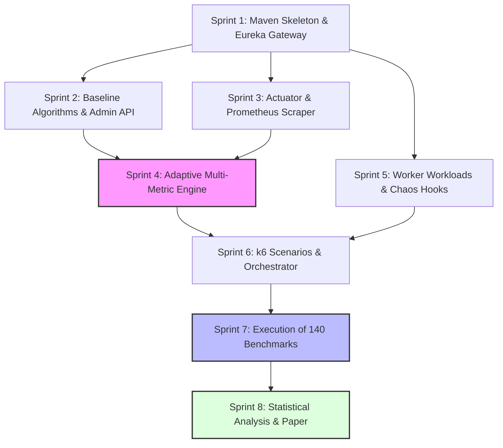

# Project Timeline & Sequential Task Execution Plan

## 1. Executive Summary & Schedule Overview

This document specifies the end-to-end engineering, benchmarking, and academic write-up timeline for the **Adaptive Load Balancer for Microservices (ALB-M)** project.

The plan is structured across **8 sequential weekly sprints (or 8 development milestones)** designed to minimize rework by strictly enforcing dependency order: foundational infrastructure is built first, followed by baselines, observability, the adaptive algorithm, chaos testing, automated benchmarking, statistical evaluation, and finally paper authoring.

```
Week 1          Week 2          Week 3          Week 4          Week 5          Week 6          Week 7          Week 8
┌──────────────┬──────────────┬──────────────┬──────────────┬──────────────┬──────────────┬──────────────┬──────────────┐
│ Sprint 1:    │ Sprint 2:    │ Sprint 3:    │ Sprint 4:    │ Sprint 5:    │ Sprint 6:    │ Sprint 7:    │ Sprint 8:    │
│ Foundation & │ Baselines &  │ Observability│ Adaptive     │ Chaos & Fault│ Automated k6 │ 140 Test Runs│ Statistical  │
│ Skeleton     │ Admin API    │ Pipeline     │ Core Engine  │ Injection    │ Harness      │ & Raw Data   │ Analysis &   │
│              │              │              │              │              │              │ Collection   │ Paper Draft  │
└──────────────┴──────────────┴──────────────┴──────────────┴──────────────┴──────────────┴──────────────┴──────────────┘
```

---

## 2. Dependency Graph & Critical Path



*The **Critical Path** runs through: Skeleton $\to$ Observability $\to$ Adaptive Engine $\to$ Chaos $\to$ Orchestrator $\to$ Execution $\to$ Analysis.*

---

## 3. Sprint-by-Sprint Sequential Tasks

### 📅 Sprint 1: Foundation, Skeleton & Service Discovery
**Timeline:** Days 1 – 7  
**Primary Deliverable:** Working reverse-proxy gateway routing to worker instances via Eureka.

| Task ID | Task Description | Dependencies | Deliverable / Acceptance Criteria |
| :--- | :--- | :--- | :--- |
| **T1.1** | Initialize parent Maven POM with Spring Boot 3.3.x, Spring Cloud 2023.x, Java 21. | None | Clean root `pom.xml` with dependency management. |
| **T1.2** | Build `service-registry` module with Eureka Server (`@EnableEurekaServer`, port 8761). | T1.1 | Eureka dashboard accessible at `http://localhost:8761`. |
| **T1.3** | Build minimal `demo-worker` module that registers with Eureka under service ID `DEMO-SERVICE`. | T1.2 | Worker instance shows as `UP` in Eureka registry. |
| **T1.4** | Build `gateway` module with Spring Cloud Gateway and Eureka Client. | T1.3 | Gateway proxies `/api/v1/compute` to `lb://DEMO-SERVICE`. |
| **T1.5** | Create initial `docker-compose.yml` spinning up Eureka, Gateway, and 3 Worker replicas. | T1.4 | `docker compose up` spins up healthy 5-container cluster. |

---

### 📅 Sprint 2: Baseline Routing Algorithms & Admin Control Plane
**Timeline:** Days 8 – 14  
**Primary Deliverable:** Gateway capable of switching between Round Robin, Weighted Round Robin, and Least Connections at runtime without restarts.

| Task ID | Task Description | Dependencies | Deliverable / Acceptance Criteria |
| :--- | :--- | :--- | :--- |
| **T2.1** | Define core Java interface `RoutingStrategy` and `RoutingContext` abstractions. | T1.4 | Decoupled interface contract in `gateway/routing`. |
| **T2.2** | Implement `RoundRobinStrategy` using atomic modulo counter. | T2.1 | Unit tests confirm strict cyclic round-robin distribution. |
| **T2.3** | Implement Nginx-style `SmoothWeightedRoundRobinStrategy` with dynamic weight decay. | T2.1 | Tests verify smooth distribution according to instance weights without clustering. |
| **T2.4** | Implement `LeastConnectionsStrategy` using reactive Netty in-flight connection tracking. | T2.1 | Traffic dynamically routes to the node with fewest active requests. |
| **T2.5** | Implement Gateway Admin REST API (`POST /admin/routing/strategy` and `GET /admin/routing/status`). | T2.2 - T2.4 | Runtime strategy switching confirmed via `curl`. |

---

### 📅 Sprint 3: Telemetry & Observability Pipeline
**Timeline:** Days 15 – 21  
**Primary Deliverable:** High-frequency Prometheus telemetry collection and live Grafana research dashboard.

| Task ID | Task Description | Dependencies | Deliverable / Acceptance Criteria |
| :--- | :--- | :--- | :--- |
| **T3.1** | Instrument `demo-worker` with Micrometer custom gauges (`active_requests`, `cpu_usage`, `memory_ratio`). | T1.3 | `/actuator/prometheus` exposes all custom metrics. |
| **T3.2** | Build Prometheus Docker container with high-resolution research scrape profile (1s intervals). | T3.1 | Prometheus scrapes all 3 workers and Gateway successfully. |
| **T3.3** | Build Grafana provisioning and dashboard (`alb-research-dashboard.json`). | T3.2 | Real-time panels for Throughput, $P_{50}/P_{95}/P_{99}$ latency, CPU %, and error rates. |
| **T3.4** | Verify Prometheus query performance under synthetic traffic; confirm TSDB write stability. | T3.3 | No dropped scrapes or Prometheus memory spikes under 1000 req/s. |

---

### 📅 Sprint 4: Multi-Metric Adaptive Routing Engine (MM-AR)
**Timeline:** Days 22 – 28  
**Primary Deliverable:** Fully functional closed-loop adaptive routing filter with normalization, composite scoring, hysteresis, and Softmax dispatch.

| Task ID | Task Description | Dependencies | Deliverable / Acceptance Criteria |
| :--- | :--- | :--- | :--- |
| **T4.1** | Implement `MetricCache` and background asynchronous poller (`Flux.interval`) in Gateway. | T2.1, T3.1 | Decoupled cache refreshed every 500ms; zero Prometheus queries on data plane. |
| **T4.2** | Implement metric normalizers ($S_{\text{cpu}}, S_{\text{mem}}, S_{\text{lat}}, S_{\text{conn}}, S_{\text{err}}$) mapping values into $[0.0, 1.0]$. | T4.1 | Mathematical normalizers verified with comprehensive unit tests. |
| **T4.3** | Implement weighted composite scoring engine: $Score(i) = \sum w_k S_k(i)$. | T4.2 | Accurate scores computed and stored in `InstanceTelemetrySnapshot`. |
| **T4.4** | Implement Boltzmann/Softmax probabilistic routing generator ($P(i) = \frac{e^{S_i/\tau}}{\sum e^{S_j/\tau}}$). | T4.3 | Verifiable probabilistic traffic distribution governed by temperature $\tau$. |
| **T4.5** | Implement Hysteresis dampener ($\delta = 0.10$) and node quarantine tiering (Healthy, Degraded, Unhealthy). | T4.4 | Zero routing flapping detected under borderline score fluctuations. |
| **T4.6** | Implement dynamic weight adjustment API (`POST /admin/routing/weights`). | T4.3 | Real-time weight reconfiguration verified without packet drops. |

---

### 📅 Sprint 5: Chaos Engineering & Fault Injection Suite
**Timeline:** Days 29 – 35  
**Primary Deliverable:** Programmable, reproducible degradation hooks built into worker microservices.

| Task ID | Task Description | Dependencies | Deliverable / Acceptance Criteria |
| :--- | :--- | :--- | :--- |
| **T5.1** | Implement CPU Burn Hook (`POST /chaos/cpu-burn`) using multi-threaded ALU loops. | T1.3 | Worker CPU saturates to $> 85\%$ on demand for exact duration. |
| **T5.2** | Implement Latency Injection Filter (`POST /chaos/latency`) with Gaussian jitter. | T1.3 | Controlled delay added to worker responses verified via curl/Prometheus. |
| **T5.3** | Implement HTTP 500 Error Burst Generator (`POST /chaos/error-burst`). | T1.3 | Configurable percentage of requests fail with 500 error status. |
| **T5.4** | Implement Reset Hook (`POST /chaos/reset`) and status check endpoint. | T5.1 - T5.3 | Instantly returns worker to healthy state. |
| **T5.5** | Validate container kill recovery (`docker kill alb-worker-2`) and health eviction timing. | T1.5, T4.5 | Gateway detects crashed node and isolates it in $< 1$ scrape cycle. |

---

### 📅 Sprint 6: Load Generation & Automated Testbed Orchestration
**Timeline:** Days 36 – 42  
**Primary Deliverable:** End-to-end automated testing harness executing k6 load profiles and chaos triggers synchronously.

| Task ID | Task Description | Dependencies | Deliverable / Acceptance Criteria |
| :--- | :--- | :--- | :--- |
| **T6.1** | Develop k6 script for Scenario 1 (Baseline Steady-State: 150 req/s, 10 min). | T1.4 | `k6 run exp1.js` executes reliably with zero test errors. |
| **T6.2** | Develop k6 script for Scenario 2 (Scalability Curve: $100 \to 3000$ req/s steps). | T1.4 | Step-wise load profile generates smooth ramp-up curves. |
| **T6.3** | Develop k6 script for Scenario 3 (Heterogeneous Degradation: 600 req/s + fault injection). | T5.2, T6.1 | Coordinated fault injection and traffic generation script. |
| **T6.4** | Develop k6 scripts for Scenarios 4 & 5 (Traffic Burst 3500 req/s & Container Termination). | T5.5, T6.1 | Replicable burst and crash scenarios completed. |
| **T6.5** | Write Python master test orchestrator (`experiments/orchestrator.py`). | T2.5, T5.4, T6.1-T6.4 | Single command runs entire test matrix autonomously and logs results to CSV. |

---

### 📅 Sprint 7: Empirical Benchmark Execution & Data Harvesting
**Timeline:** Days 43 – 49  
**Primary Deliverable:** 140 benchmark executions completed with zero anomalies; comprehensive raw telemetry and k6 summary CSVs archived.

| Task ID | Task Description | Dependencies | Deliverable / Acceptance Criteria |
| :--- | :--- | :--- | :--- |
| **T7.1** | Run calibration test (dry run) in isolated Docker environment to ensure zero host background noise. | T6.5 | Host CPU/RAM baseline confirmed stable. |
| **T7.2** | Execute Scenarios 1 & 2 across all 4 algorithms $\times$ 5 replications (40 runs). | T7.1 | Raw k6 JSON summaries and Prometheus TSDB metrics exported. |
| **T7.3** | Execute Scenario 3 (Degradation) across all 4 algorithms $\times$ 5 replications (20 runs). | T7.2 | Exact $T_{\text{adapt}}$ and tail latency logs captured. |
| **T7.4** | Execute Scenarios 4 & 5 (Burst & Crash) across all algorithms $\times$ 5 replications (40 runs). | T7.3 | Error containment and recovery time datasets captured. |
| **T7.5** | Execute Scenario 6 (Scrape Frequency: 100ms - 5s) and Scenario 7 (Weight Sensitivity) (40 runs). | T7.4 | Trade-off data matrix and sensitivity table populated. |
| **T7.6** | Archive all raw datasets into `experiments/results/raw/` with immutable checksums. | T7.2 - T7.5 | 140 clean datasets verified and backed up. |

---

### 📅 Sprint 8: Statistical Analysis, Data Visualization & Paper Writing
**Timeline:** Days 50 – 56  
**Primary Deliverable:** Publication-grade academic paper draft, LaTeX source, and high-resolution figures.

| Task ID | Task Description | Dependencies | Deliverable / Acceptance Criteria |
| :--- | :--- | :--- | :--- |
| **T8.1** | Build Python analysis script (`experiments/analysis/compute_stats.py`) using Pandas & SciPy. | T7.6 | Automated calculation of mean, median, $P_{95}, P_{99}$, Jain's index, and $T_{\text{adapt}}$. |
| **T8.2** | Run normality checks (Shapiro-Wilk) and non-parametric hypothesis tests (Wilcoxon Signed-Rank). | T8.1 | Formal $p$-values and Cliff's $\delta$ effect sizes generated for Hypotheses $H_1 - H_4$. |
| **T8.3** | Generate publication figures (Latency CDF curves, box plots, adaptation timeline curves, radar chart). | T8.1 | High-DPI vector PDF/PNG charts generated in `experiments/results/figures/`. |
| **T8.4** | Draft Sections 1–7 of the research paper (Introduction, Background, Architecture, Algorithm, Methodology). | T8.3 | Academic draft conforming to IEEE/ACM 2-column format. |
| **T8.5** | Draft Sections 8–15 (Empirical Evaluation, Trade-off, Discussion, Limitations, Conclusion). | T8.2, T8.4 | Complete 10–12 page academic research paper draft ready for peer review. |

---

## 4. Milestone Checkpoints & Quality Gates

```
M1 (Day 7):  Gateway passes traffic to 3 worker nodes.
M2 (Day 14): Round Robin, WRR, and Least Connections verified under basic load.
M3 (Day 21): Prometheus scraping at 1s without dropping data; Grafana dashboard live.
M4 (Day 28): Adaptive engine steers traffic away from artificially slowed instance.
M5 (Day 35): All 4 chaos hooks (CPU, delay, errors, container kill) operate deterministically.
M6 (Day 42): Orchestrator executes multi-algorithm test scenarios hands-free.
M7 (Day 49): 140 experimental benchmark runs archived without data corruption.
M8 (Day 56): Statistical analysis confirms H1-H4; research paper draft completed.
```

---

## 5. Risk Assessment & Contingency Buffers

| Risk | Probability | Impact | Mitigation Strategy |
| :--- | :--- | :--- | :--- |
| **Prometheus high-frequency scrape overhead** | Medium | Medium | If 1s scraping strains worker CPU, decouple by having Gateway read local connection counters immediately and throttle scrape interval to 2s ($T_{\text{refresh}}$ sensitivity already tested in Exp 6). |
| **Host machine resource contention** | High | High | Restrict Docker container cgroup CPU quotas (`cpus: "1.0"`) and run benchmarks during dedicated off-peak windows with background processes terminated. |
| **Traffic flapping under sudden load** | Medium | High | Softmax temperature ($\tau = 0.25$) and hysteresis threshold ($\delta = 0.10$) are pre-designed into Sprint 4 to dampen oscillations mathematically. |
| **Data loss during long test runs** | Low | High | Python orchestrator writes raw streaming JSON results to disk per scenario iteration immediately upon completion. |
